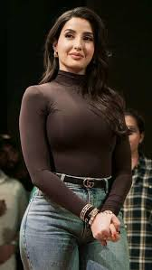

# Addition PROMPT OF GPT TO EDIT PHOTO TO PROFESSIONAL LOOK.

Edit this image to create an editorial portrait look. Keep my original face and expression. Change my outfit to a sharp, textured red blazer with layered gold chains. Set the background to a deep amber-red gradient. Apply dramatic, high-detail lighting: strong directional hard light from the left to highlight my cheekbones and jawline, leaving a soft but deep shadow on the right side of my face. Enhance my skin texture with ultra-crisp detail and soft shadows for a cinematic, freeze-frame effect. Add a soft bloom where the gold chains catch the light, with minimalist composition and a powerful, clean framing.

# 🔥 Editorial Portrait Showcase

This project highlights two distinct editorial looks featuring strong fashion aesthetics and lighting.

---

## 🖼️ Sample Images from the Project

### 🔹 Image 1 - JFIF Format

### 🔹 Image 2 - Red Blazer

## ✨ Prompt Used to Edit Red Blazer Photo

> Edit this image to create an editorial portrait look. Keep my original face and expression. Change my outfit to a sharp, textured red blazer with layered gold chains. Set the background to a deep amber-red gradient. Apply dramatic, high-detail lighting: strong directional hard light from the left to highlight my cheekbones and jawline, leaving a soft but deep shadow on the right side of my face. Enhance my skin texture with ultra-crisp detail and soft shadows for a cinematic, freeze-frame effect. Add a soft bloom where the gold chains catch the light, with minimalist composition and a powerful, clean framing.

---

